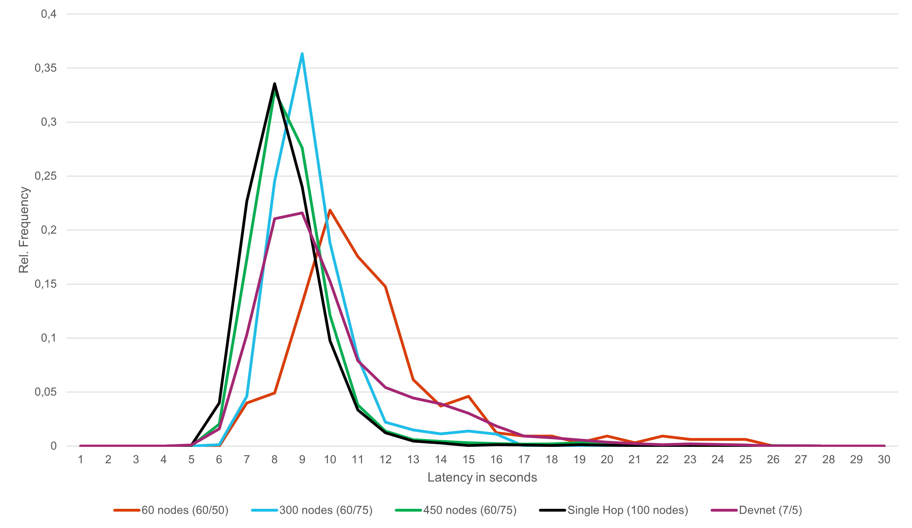

This repository contains the results of a proof-of-concept project which evaluates the feasability of running dash nodes in the Tor network.

# Project goal
The project goal is to determine the feasibility of moving masternodes in Dash-Architecture into the TOR-Network. Questions that need to be clearified are:
1. How to modify Dash in order to accept Masternodes with Onion addresses? -> take a look at the modified Dash source code
2. Is CoinJoin still working? -> We figuered out it is still working
3. Will the performance of InstantSend suffer? How much? -> Take a look at **Measurements**

# Measurements
Multiple teststeps with different network configurations has been performed. While CoinJoin was funcitonal in each teststep, the InstantSend performance varies.
Each teststep was run for multiple days in order to remove possible side effects from the network layer. Additionally the frequencies are aggregated per second and were presented as relative frequencies in order to be able to compare the results. You can find raw values in the measurements folder: [relative frequencies InstantSend](measurements/instantsend_duration_relative_frequencies.csv).
*In each step the quorum for InstantSend is set to the MainNet quorum size if possible. Otherwise the largest possible quorum for the DevNet is selected for InstantSend.*

The assumption why larger networks lead to a better performance of InstantSend is that in our "perfect" environment every masternode behaves identically. With a growing number nodes inside the network, the chance increases that the required number of nodes perform this step faster which leads to faster transaction times.

# Proof-of-concept
The project uses Docker and Docker Compose to run a devnet consisting of multiple Dash nodes on one host machine.
The devnet typically consists of the following components:
- Masternode registration service
- Dash nodes
- Dash masternodes
- DASHBoard

## Setup
To run a local devnet using docker, use the following steps as a guideline:

1. Build docker images with `docker-compose build`
2. Start the masternode registration service: `docker-compose up -d masternode_api`
3. View log (`docker-compose logs -f`) and take note of the node address
4. Add the node address to the `INITIAL_NODE` environment variable of the `dashd` and `masternode` containers in the `docker-compose.yml` file.
5. Start everything using `docker-compose up -d`
6. Check log to make sure everything starts normally (masternode registered)
7. Scale up  the devnet: `docker-compose up -d --scale dashd=5 --scale masternode=50`
8. Watch logs and restart everything with `docker-compose restart` after all masternodes have been registered
9. Watch network health using `docker-status.sh` or take a look at the health monitor: `http://ip.of.your.server:5000/index.html`

### Additional notes:
- It can take 5-15 minutes, till all nodes have established some connections
- When the masternode api shows error 429 in the log that is just a rate limit to prevent too many transactions from being created at the same time
- Every now and then a masternode might get POSE-banned. Commands to unban the nodes are written to `/dash/data/reactivate_masternodes.sh` within the masternode api container.
# Explanation of this repository
The repository consists of multiple different packages thar are needed or helpful to run the devnet. It consists of the following packages:

**dashboard**: A monitoring tool visualize current states and transaction times of the devnet. It is useful to see errors and timing problems during the tests and identify nodes which are causing problems. A description how to install and use the tool is inside the package.

**measurements**: Contains the measurements of the project and a graphic with the final results.

**src**: Contains the dash demons to run a masternode and all related files. The package includes a readme with a discription how to run and use it.

