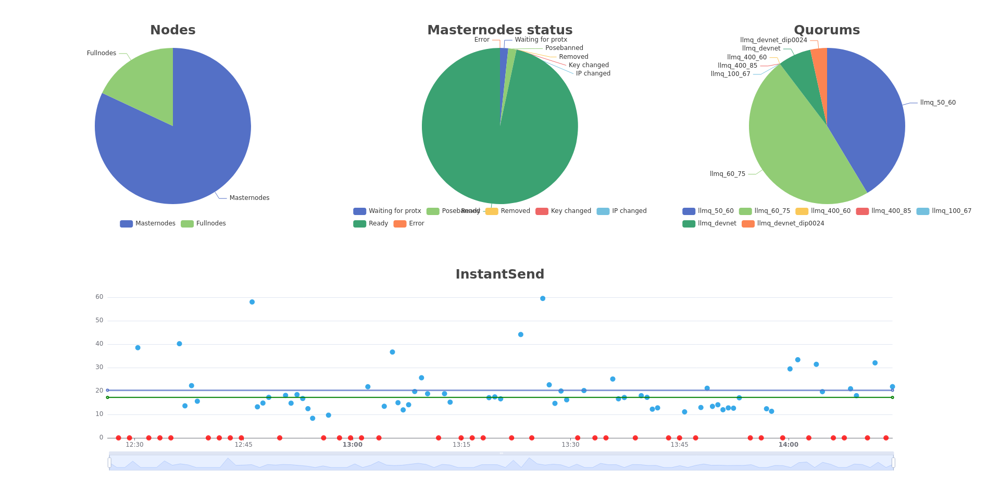

# DASHboard

DASHBoard is a visualization tool to monitor the current health of the devnet. It helps to see failed masternodes and other errors as well as timing issues.

## frontend

The frontend connects via Websocket to the backend and the backend pushes the data to the frontend. You can see pie-charts for the masternode and fullnode distribution, masternode status and quorum types in the network. After clicking on a data point inside the pie charts, a dialog opens that show all nodes inside this data point. This is important to identify nodes with specific states or types. Below the pie charts is a line-chart that show the last InstantSend durations as well as Timouts to visualize the current delay in the devnet. An example of the frontend is seen in the below image:



### Use with docker

The frontend and backend are combined into the docker container. To backend server serves the static files for the frontend and pushes the new data to it. To start both, just start the docker container. For the final use it's important to configure port forwarding to the docker container to make it possible to interact with the container from the outside of the docker architecture.

### Use without docker

#### Installation

1. Clone this repository to your local storage
2. Install node.js 14.x
```
sudo apt update
curl -sL https://deb.nodesource.com/setup_14.x | sudo bash -
sudo apt -y install nodejs
```
3. Move into the frontend directory of the repository and install the dependencies
```
cd frontend
npm install
```
4. Install the angular cli
```
sudo npm install -g @angular/cli
```

#### How to use

1. Run `ng serve` in the frontend directory and open http://localhost:4200/ in the browser
2. Move to project dir/frontend/src/environments and edit the ip and port in environment.prod.ts to connect to the correct backend
```
export const environment = {
  production: true,
  wsEndpoint: 'ws://10.0.1.192:5678',
  reconnectInterval: 2000
}; 
```
## Backend

The backend service collects various statistics from the dash nodes and safes them locally to push them to the frontend later on. The collection of the data happens through a backend api that the nodes are calling frequently to push their data to the backend server.

### Use with docker

To run the backend server, just start the docker file. As for the frontend, a port forwarding has to configured. Otherwise the backend likely won't function as expected.

### Use without docker

#### Installation

1. Make sure python is installed with `python -v` and install it with `apt install python3` if its not installed
2. Install the needed dependencies

  `pip install websockets`

#### How to use

Start the service: 
```
python3 backend_server.py -p <Port, optional, default: 5678>
```
